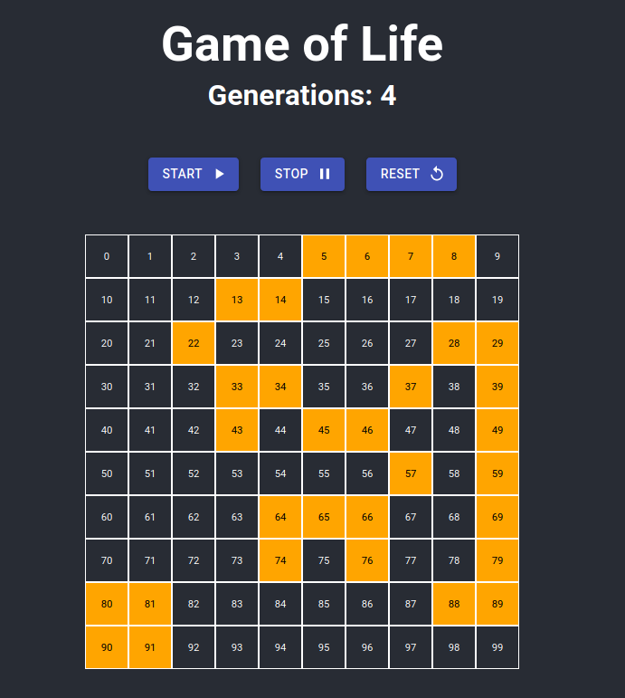

1. Todo (with redux, react-redux):

   [Demo](https://truculent-dock.surge.sh)
   

      
   

2. Customer Table

   [Demo](https://rude-disgust.surge.sh)

    

         
    

3. Spotifier
	[Demo](https://efficient-verse.surge.sh)
   

         
    

4. Recipes
	[Demo](https://towering-stomach.surge.sh/)
   
   

         
 

   
5. Game of Life
	[Demo](https://crazy-grain.surge.sh/)
   
   

         
 

   
6. Email:

   [Demo](https://old-poison.surge.sh/)

      

            
    
